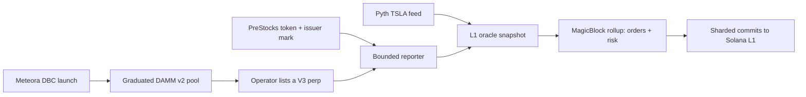
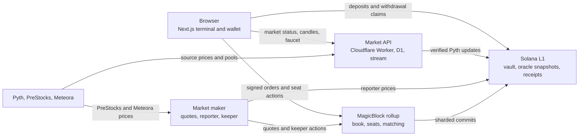

<p align="center">
  <picture>
    <source media="(prefers-color-scheme: dark)" srcset="public/brand/equinox-dark.png">
    <source media="(prefers-color-scheme: light)" srcset="public/brand/equinox-light.png">
    
  </picture>
</p>

# Equinox

Equinox is a devnet trading app for stock-themed perpetuals and token launches on Solana. Orders execute in a MagicBlock Ephemeral Rollup; collateral stays in a Solana L1 vault. The app currently lists TSLA-PERP and three PreStocks-priced pre-IPO markets. A separate launch flow creates equity-themed tokens on Meteora Dynamic Bonding Curves.

**[Open the app](https://equinox.ansht.workers.dev)** · [Current devnet status](docs/status/current.md) · [Architecture details](docs/architecture.md)

This is a devnet project. Its USDC and SOL are test tokens. PreStocks tokens linked from the pre-IPO page are separate **mainnet** assets; using Equinox perps does not buy those tokens.

## What you can do

| Area | In the app |
| --- | --- |
| Trade | Place market or limit perp orders, inspect the live book and trades, and manage isolated collateral per market. |
| Pre-IPO | Trade OPENAI-PERP, SPACEX-PERP, and ANTHROPIC-PERP or submit a basket of whole-share legs. |
| Launch | Create and trade USD-priced Meteora DBC tokens; graduated pools can become perp price sources. |
| Account | Connect a Solana wallet or Privy wallet, fund a devnet seat, review positions and activity, and withdraw. |

The market list and addresses come from [`config/equinox-deployment.json`](config/equinox-deployment.json). A new listing should update that manifest, not a hard-coded selector.

### Listed markets and price sources

| Market | Reference price | Where to find it |
| --- | --- | --- |
| `TSLA-PERP` | Pyth `Equity.US.TSLA/USD`, feed 1435 | `/trade?market=TSLA-PERP` |
| `OPENAI-PERP` | PreStocks OPENAI token price | `/trade?market=OPENAI-PERP`, `/pre-ipo` |
| `SPACEX-PERP` | PreStocks SPACEX token price | `/trade?market=SPACEX-PERP`, `/pre-ipo` |
| `ANTHROPIC-PERP` | PreStocks ANTHROPIC token price | `/trade?market=ANTHROPIC-PERP`, `/pre-ipo` |

These four markets share one exchange and test-USDC mint, but each trader has a separate seat and isolated margin in each market. The committed [deployment manifest](config/equinox-deployment.json) is the source of truth for addresses and oracle configuration. No current market uses a Meteora pool as its price source.

## Sponsor add-ons and integrations

Each integration has a specific role in the deployed product:

| Integration | Equinox use | User-facing result |
| --- | --- | --- |
| **MagicBlock** | Runs delegated V3 order-book, seat, and event accounts in an Ephemeral Rollup; commits state back to Solana. | Fast orders and live book updates. |
| **Pyth** | Supplies the authenticated TSLA equity price, verified before the L1 snapshot is updated. | TSLA perp pricing and session-aware order checks. |
| **PreStocks** | Supplies token and issuer-mark data; its tokens anchor three reporter-priced perp markets. | Pre-IPO perps, price comparisons, and baskets. |
| **Meteora** | Provides Dynamic Bonding Curves for launches and DAMM v2 pools after graduation. | Create and trade a token; a graduated pool can later price a new perp. |
| **Privy** | Provides a sign-in and wallet path alongside Solana wallet support. | Wallet access and authorization of a local trading key. |

### PreStocks: token data to devnet perps

The `/pre-ipo` page loads the PreStocks catalog through the Market API and shows the issuer mark, token price, and Equinox perp price side by side. OPENAI, SPACEX, and ANTHROPIC have listed perps. For these markets, the Rust reporter uses the token's on-chain price, constrained to within ±50% of the PreStocks mark. The on-chain program additionally limits each reporter post to a movement of **0.5% + 0.1% per elapsed second, capped at 10%**. The resulting L1 snapshot is the price used by rollup matching and risk checks. This is a named-reporter trust model, not a Pyth-signed feed.

A basket estimates whole-share legs and required margin before submission. After the trading key is authorized, it creates missing seats, funds isolated margin when needed, and sends each leg's order. PreStocks tokens themselves trade on **Solana mainnet** through external links; Equinox perps use **devnet test USDC**. The [frontend guide](app/README.md#pre-ipo-and-launch-flows) explains the UI paths.

### Meteora: launch to possible perp listing

The `/launch` page creates a Meteora DBC config and pool priced in **test USDC**. Its three equity-themed presets set curve economics, including fee behavior and graduation settings. Users can buy or sell on the curve and follow the pool as liquidity migrates to DAMM v2. The launch registry stores display metadata; the pool on Solana is authoritative.

Graduation does **not** list a perp automatically. An operator can run [`scripts/list-market.sh`](scripts/list-market.sh) with the symbol, feed ID, `meteora`, DAMM v2 pool, and token mint. That process creates and delegates a V3 market, names the keeper and reporter, funds the service, and updates the deployment manifest. The reporter can then derive the perp reference price from the DAMM v2 pool's `sqrt_price` and lot size. This route is implemented, but none of the four currently listed markets is Meteora-priced.



## How the pieces fit



### Execution and custody

The on-chain V3 market has one core, 18 book pages, four seat shards, and four event shards. These 27 execution accounts run in the rollup, where matching, margin, funding, and liquidation execute. The USDC vault and oracle snapshot remain on L1. The keeper periodically commits sharded rollup state to L1.

1. **Fund a seat:** the trader deposits test USDC into the L1 vault, creating an inbox receipt; a rollup claim credits that trader's isolated market seat.
2. **Place an order:** the browser signs a market or limit instruction with the selected wallet or authorized trading key. The rollup matches it against the delegated book and updates seat and event state.
3. **Withdraw:** the rollup checks risk and debits the seat into an outbox request; the L1 claim transfers test USDC from the vault to that seat owner's wallet.

The maker maintains resting quotes. The keeper scans for liquidation, applies funding, and commits state. A flat seat can still withdraw if a live oracle price is unavailable; a seat with a position uses the program's stressed last authenticated price rule. See the [program guide](programs/equinox/README.md) for instruction names and custody boundaries.

### Browser, API, and service responsibilities

- The **frontend** reads the delegated book and account state, renders the terminal, and builds signed instructions using the shared TypeScript ABI client. A one-time wallet authorization derives a trading key remembered per device.
- The **Market API** serves market metadata, history and status, proxies the PreStocks catalog, registers launches, handles test faucet requests, and refreshes the verified Pyth price. D1 stores registry and faucet-claim records.
- The **Rust service** quotes the book, reports non-Pyth prices, watches liquidations and funding, commits state, and exposes status and reporter-market candles.

The [frontend](app/README.md), [Worker](workers/README.md), [market-maker](services/market-maker/README.md), and [TypeScript client](clients/equinox/README.md) guides show the code boundaries and local commands.

## First devnet trade

1. Open `/trade` and connect a Solana wallet or sign in with an available Privy method.
2. Claim test funds in the wallet panel, then start trading. The app creates a market seat and funds its isolated collateral if needed.
3. Pick a market, choose a side and size, and submit a market or limit order. The ticket shows the expected cost before submission.
4. Watch the book, activity, and positions as the rollup processes the order. The keeper later commits the market state to L1.
5. Use the account controls to withdraw test collateral to the connected wallet.

The exact prompts depend on the active wallet and whether its trading key is already authorized. The [current status](docs/status/current.md) records the verified devnet flow and its transaction evidence.

For a pre-IPO basket, visit [`/pre-ipo`](https://equinox.ansht.workers.dev/pre-ipo), review its planned legs and margin, then submit. For a token launch, visit [`/launch`](https://equinox.ansht.workers.dev/launch) and choose a curve preset. A launch needs a separate operator listing before it becomes a perp.

## Repository map

| Path | Owns |
| --- | --- |
| [`app/`, `features/`, `components/`, `lib/`](app/README.md) | Next.js routes, terminal UI, wallet state, trading flows, and browser data adapters. |
| [`programs/equinox/`](programs/equinox/README.md) | Pinocchio Solana program: markets, matching, risk, custody, sessions, and rollup lifecycle. |
| [`clients/equinox/`](clients/equinox/README.md) | TypeScript instruction builders, PDA derivation, decoders, and ABI fixtures. |
| [`workers/`](workers/README.md) | Market API, authenticated ingestion, D1 registry, live stream, faucet, and oracle refresh. |
| [`services/market-maker/`](services/market-maker/README.md) | Rust quoting bot, price reporters, keeper jobs, candles, and transaction status. |
| [`config/`](config/equinox-deployment.json) | Public devnet deployment manifest. |
| [`scripts/`](scripts/list-market.sh) | Operator tooling for listing and maintaining markets. |
| [`docs/`](docs/README.md) | Architecture, operations, evidence, and dated status. |

## Devnet deployment reference

| Item | Current value or source |
| --- | --- |
| Equinox program | `8Ucdsd3ejSEFFTpUivfK84eZv2q6aAe83A9zwSBcxFZ` |
| Network | Solana devnet; MagicBlock `devnet-as` rollup |
| Market cores, oracle snapshots, collateral mint | [`config/equinox-deployment.json`](config/equinox-deployment.json) |
| Current operation and evidence | [`docs/status/current.md`](docs/status/current.md) |

Read the manifest for full addresses rather than copying them into application code. The service and frontend both resolve markets from it.

## Run the frontend locally

Requires Node **24.10+** and npm **11.19+**. From the repository root:

```bash
npm install
npm run dev
```

Open `http://localhost:3000`. The UI can render without wallet credentials; live sign-in and trading need the relevant values from [`.env.example`](.env.example) supplied through an untracked `.env.local`. Use the [frontend guide](app/README.md) for the few variables that matter to each flow. Never put a private RPC key or server secret in a `NEXT_PUBLIC_` variable.

The on-chain program and market API are separate processes. Their local commands and deployment requirements live in their own READMEs. The committed manifest targets **devnet**; local development does not start a local validator or a rollup.

## Useful commands

```bash
npm run dev             # Next.js development server
npm run build           # Next.js production build
npm run lint            # ESLint
npm test                # unit tests
npm run test:browser    # Playwright browser suite
npm run check:secrets   # scan tracked files and bundles for secret patterns
```

The Rust program has its own Cargo commands in the [program guide](programs/equinox/README.md); the Worker has its own package scripts. For current devnet behavior and evidence, use the dated [status snapshot](docs/status/current.md).

## Current limits

- This deployment is for devnet test assets. It is not a mainnet exchange.
- Taking a delegated V3 market out of the rollup is blocked by the current MagicBlock devnet delegation program. Normal trading and commits do not depend on that operation.
- The vault remains on L1, but there is no completed L1 emergency exit if the rollup becomes permanently unavailable.
- Pre-IPO and launched-token perp prices use a bounded reporter key. Pyth prices TSLA-PERP. See [architecture](docs/architecture.md) for the trust boundary and source-specific checks.
- A Meteora token graduating to DAMM v2 needs an operator listing before it appears as an Equinox perp.

For current behavior, use [`docs/status/current.md`](docs/status/current.md). Older design notes in `docs/` record the path to this deployment and may describe superseded states.
