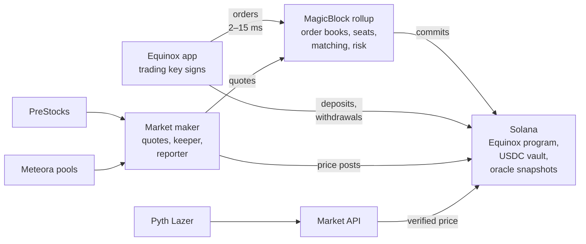
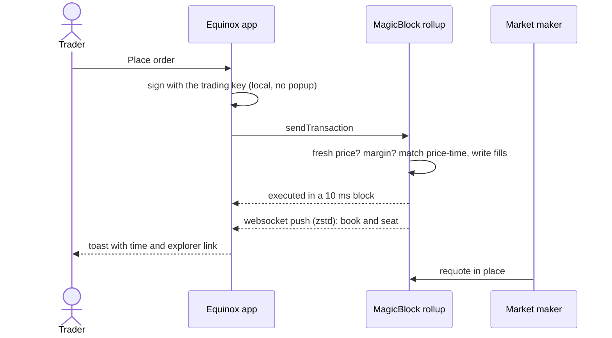

<p align="center">
  <picture>
    <source media="(prefers-color-scheme: dark)" srcset="public/brand/equinox-dark.png">
    <source media="(prefers-color-scheme: light)" srcset="public/brand/equinox-light.png">
    
  </picture>
</p>

<h1 align="center">Equinox</h1>

<p align="center">
  Perpetual futures on tokenized assets at rollup speed.<br>
  Orders match in a <b>MagicBlock</b> Ephemeral Rollup, prices are verified on <b>Solana</b>, and USDC never leaves the Solana vault.
</p>

<p align="center">
  <a href="https://equinox.ansht.workers.dev"><b>Open the app</b></a> ·
  <a href="https://equinox-docs.ansht.workers.dev"><b>Docs and diagrams</b></a> ·
  <a href="docs/architecture.md">Architecture</a> ·
  <a href="docs/status/current.md">Devnet status</a>
</p>

<p align="center">
  
  
  
  
  
</p>

> **Devnet only.** USDC and SOL here are test tokens. PreStocks tokens linked from the Pre-IPO page are separate **mainnet** assets; trading an Equinox perp does not buy them.

## At a glance

| | |
|---|---|
| **Order executed in the rollup** | 2–15 ms (10 ms blocks) |
| **Click to order visible in the book** (from India) | ~180 ms |
| **Wallet prompts** | one, to derive the trading key; everything after signs silently |
| **Markets** | TSLA-PERP (Pyth) · OPENAI-, SPACEX-, ANTHROPIC-PERP (PreStocks) |
| **Accounts delegated per market** | 27: core, 18 book pages, 4 seat shards, 4 event shards |
| **Rollup cost** | ~90k CU per requote, ~53k CU per taker order |

## What you can do

| | |
|---|---|
| **Trade** | Market and limit perp orders (IOC, post-only, reduce-only) on a live price-time order book, with isolated margin per market and one-click close. |
| **Pre-IPO** | Trade OpenAI, SpaceX and Anthropic perps priced from PreStocks tokens, or buy a basket (e.g. *AI labs*) in one click. |
| **Launch** | Create stock-themed tokens on Meteora Dynamic Bonding Curves priced in USDC, trade them on the Pulse board, and graduate them to DAMM v2. A graduated pool can price a new perp. |
| **Account** | Connect a Solana wallet or Privy, claim test funds, deposit, watch positions and every rollup transaction live, and withdraw to your wallet. |

## How it works



- **Fast path in the rollup.** Each market's 27 execution accounts are delegated to MagicBlock, so placing, cancelling and matching orders, margin checks, funding and liquidation run at a few milliseconds per transaction.
- **Safe state on Solana.** The USDC vault and the verified price snapshots never leave L1. The keeper commits the rollup's state back to Solana every 30 minutes (trading pauses ~1.2 s).
- **Custody by receipt.** Money moves in through an inbox (deposit 60 on L1, claim 61 in the rollup) and out through an outbox (risk-checked request 62 in the rollup, claim 63 on L1 that pays only the seat owner).
- **Two price paths, one snapshot.** TSLA uses Ed25519-verified Pyth Lazer updates. Pre-IPO and launched tokens use a named reporter bounded by the program to 0.5% + 0.1% per second (max 10%) per post.

### One order, end to end



The [docs site](https://equinox-docs.ansht.workers.dev) walks through every flow with diagrams: onboarding, the market account layout, order states, pricing, funding and liquidation, commits, withdrawals, baskets, the launchpad, the market-maker service and the trust model.

## Sponsors and integrations

| | Role in Equinox | What users get |
|---|---|---|
| **MagicBlock** | Runs each market's delegated order book, seats and events in an Ephemeral Rollup; commits back to Solana. | Millisecond orders and a live book. |
| **Pyth** | Signed TSLA equity price, verified on L1 before it updates the snapshot. | TSLA perp pricing with session-aware order checks. |
| **PreStocks** | Token and issuer-mark data; its tokens anchor three reporter-priced perps. | Pre-IPO perps, price comparisons, baskets. |
| **Meteora** | Dynamic Bonding Curves for launches, DAMM v2 pools after graduation. | Launch and trade a token; a graduated pool can price a perp. |
| **Privy** | Sign-in and wallet path alongside Solana wallet adapters. | Wallet access that authorizes the trading key. |

## Quick start

Requires Node **24.10+** and npm **11.19+**.

```bash
npm install
npm run dev          # http://localhost:3000
```

The UI renders without credentials; sign-in and trading need the values in [`.env.example`](.env.example) in an untracked `.env.local`. Never put a private RPC key or server secret in a `NEXT_PUBLIC_` variable. Local development talks to the **devnet** deployment; it doesn't start a validator or a rollup.

### First devnet trade

1. Open [`/trade`](https://equinox.ansht.workers.dev/trade) and connect a wallet.
2. Press **Start trading**: sign once to derive the trading key; the app claims test funds, opens your seat and deposits.
3. Choose a side and size and place the order. Watch it land in the book and in the live transaction feed.
4. Close from the position card, or withdraw test USDC back to your wallet.

## Commands

```bash
npm run dev              # Next.js development server
npm run lint             # ESLint
npm test                 # unit tests (frontend, client)
npm run test:browser     # Playwright browser suite
npm run check:secrets    # scan tracked files and bundles for secret patterns
npm run build:vinext     # production build for Cloudflare Workers
npm run deploy:vinext    # deploy the app
npx wrangler deploy --config docs-site/wrangler.jsonc   # deploy the docs site
```

| Check | Command |
|---|---|
| Market API tests | `cd workers && npx vitest run` |
| Program tests (needs `target/deploy/equinox.so`) | `cargo test --manifest-path programs/equinox/Cargo.toml` |
| Market-maker tests | `cd services/market-maker && cargo test` |
| Script tests | `node --test scripts/*.test.mjs` |
| Live end-to-end against production | `npx tsx scripts/e2e/{onboarding,deposit,far-order,close-position,preipo,basket}.mts` |

## Repository map

| Path | Owns |
|---|---|
| [`app/`, `features/`, `components/`, `lib/`](app/README.md) | Next.js routes, terminal UI, landing page, wallet and trading flows. |
| [`programs/equinox/`](programs/equinox/README.md) | Pinocchio Solana program: markets, matching, risk, custody, rollup lifecycle. |
| [`clients/equinox/`](clients/equinox/README.md) | TypeScript instruction builders, PDA derivation, decoders, ABI fixtures. |
| [`workers/`](workers/README.md) | Market API on Cloudflare Workers and D1: oracle refresh, candles, status, faucet, launches. |
| [`services/market-maker/`](services/market-maker/README.md) | Rust service: quoting, price reporters, keeper jobs, candles, transaction stream. |
| [`docs-site/`](docs-site/public/index.html) | The docs website with end-to-end diagrams (static, its own Worker). |
| [`config/`](config/equinox-deployment.json) | Devnet deployment manifest: the source of truth for markets and addresses. |
| [`scripts/`](scripts/list-market.sh) | Operator tooling: list markets, name keepers and reporters, end-to-end checks. |
| [`docs/`](docs/README.md) | Architecture, operations and current devnet status. |

## Devnet deployment

| | |
|---|---|
| Equinox program | `8Ucdsd3ejSEFFTpUivfK84eZv2q6aAe83A9zwSBcxFZ` |
| Rollup | MagicBlock `devnet-as` (Singapore) |
| App · docs · market API | [equinox.ansht.workers.dev](https://equinox.ansht.workers.dev) · [equinox-docs.ansht.workers.dev](https://equinox-docs.ansht.workers.dev) · Cloudflare Workers |
| Market-maker service | Azure VM, Singapore (~2 ms from the rollup) |
| Market cores, oracle snapshots, USDC mint | [`config/equinox-deployment.json`](config/equinox-deployment.json) |

New markets go into the manifest (via [`scripts/list-market.sh`](scripts/list-market.sh)), never into hard-coded selectors; the app and the service both read it.

## Limits

- Devnet test assets only; not a mainnet exchange.
- Taking a market out of the rollup (undelegation) is blocked by the current MagicBlock devnet delegation program. Trading, custody and commits don't need it.
- No L1 emergency exit yet if the rollup were permanently down; the USDC stays in the L1 vault.
- Pre-IPO and launched-token prices come from a bounded reporter key, not a signed oracle network. Every post is public on L1.
- A Meteora token that graduates needs an operator listing before it becomes a perp; none of the four live markets is Meteora-priced yet.
