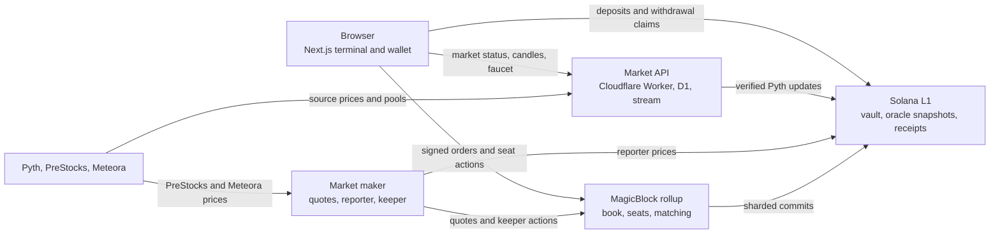

# Equinox

Equinox is a devnet trading app for stock-themed perpetuals and token launches on Solana. Orders execute in a MagicBlock Ephemeral Rollup; collateral stays in a Solana L1 vault. The app currently lists TSLA-PERP and three PreStocks-priced pre-IPO markets. A separate launch flow creates equity-themed tokens on Meteora Dynamic Bonding Curves.

**[Open the app](https://equinox.ansht.workers.dev)** · [Current devnet status](docs/status/current.md) · [Architecture details](docs/architecture.md)

This is a devnet project. Its USDC and SOL are test tokens.

## What you can do

| Area | In the app |
| --- | --- |
| Trade | Place market or limit perp orders, inspect the live book and trades, and manage isolated collateral per market. |
| Pre-IPO | Trade OPENAI-PERP, SPACEX-PERP, and ANTHROPIC-PERP or submit a basket of whole-share legs. |
| Launch | Create and trade USD-priced Meteora DBC tokens; graduated pools can become perp price sources. |
| Account | Connect a Solana wallet or Privy wallet, fund a devnet seat, review positions and activity, and withdraw. |

The market list and addresses come from [`config/equinox-deployment.json`](config/equinox-deployment.json). A new listing should update that manifest, not a hard-coded selector.

## How the pieces fit



The on-chain V3 market has one core, 18 book pages, four seat shards, and four event shards. These 27 execution accounts run in the rollup. The USDC vault remains on L1. Deposits use an L1 inbox receipt before credit reaches a rollup seat; withdrawals request a debit in the rollup before an L1 claim pays the wallet. See the [program guide](programs/equinox/README.md) for the account and custody flow.

## First devnet trade

1. Open `/trade` and connect a Solana wallet or sign in with an available Privy method.
2. Claim test funds in the wallet panel, then start trading. The app creates a market seat and funds its isolated collateral if needed.
3. Pick a market, choose a side and size, and submit a market or limit order. The ticket shows the expected cost before submission.
4. Watch the book, activity, and positions as the rollup processes the order. The keeper later commits the market state to L1.
5. Use the account controls to withdraw test collateral to the connected wallet.

The exact prompts depend on the active wallet and whether its trading key is already authorized. The [live runbook](docs/live-devnet-runbook.md) covers the transaction-level procedure.

## Repository map

| Path | Owns |
| --- | --- |
| [`app/`, `features/`, `components/`, `lib/`](app/README.md) | Next.js routes, terminal UI, wallet state, trading flows, and browser data adapters. |
| [`programs/equinox/`](programs/equinox/README.md) | Pinocchio Solana program: markets, matching, risk, custody, sessions, and rollup lifecycle. |
| [`clients/equinox/`](clients/equinox/README.md) | TypeScript instruction builders, PDA derivation, decoders, and ABI fixtures. |
| [`workers/`](workers/README.md) | Market API, authenticated ingestion, D1 registry, live stream, faucet, and oracle refresh. |
| [`services/market-maker/`](services/market-maker/README.md) | Rust quoting bot, price reporters, keeper jobs, candles, and transaction status. |
| [`config/`](config/equinox-deployment.json) | Public devnet deployment manifest. |
| [`docs/`](docs/README.md) | Architecture, operations, evidence, and dated status. |

## Run the frontend locally

Requires Node **24.10+** and npm **11.19+**. From the repository root:

```bash
npm install
npm run dev
```

Open `http://localhost:3000`. The UI can render without wallet credentials; live sign-in and trading need the relevant values from [`.env.example`](.env.example) supplied through an untracked `.env.local`. Use the [frontend guide](app/README.md) for the few variables that matter to each flow. Never put a private RPC key or server secret in a `NEXT_PUBLIC_` variable.

The on-chain program and market API are separate processes. Their local commands and deployment requirements live in their own READMEs. The committed manifest targets **devnet**; local development does not start a local validator or a rollup.

## Useful commands

```bash
npm run dev             # Next.js development server
npm run build           # Next.js production build
npm run lint            # ESLint
npm test                # unit tests
npm run test:browser    # Playwright browser suite
npm run check:secrets   # scan tracked files and bundles for secret patterns
```

The Rust program has its own Cargo commands in the [program guide](programs/equinox/README.md); the Worker has its own package scripts. For a live devnet procedure and evidence, use the [runbook](docs/live-devnet-runbook.md) and the dated [status snapshot](docs/status/current.md).

## Current limits

- This deployment is for devnet test assets. It is not a mainnet exchange.
- Taking a delegated V3 market out of the rollup is blocked by the current MagicBlock devnet delegation program. Normal trading and commits do not depend on that operation.
- The vault remains on L1, but there is no completed L1 emergency exit if the rollup becomes permanently unavailable.
- Pre-IPO and launched-token perp prices use a bounded reporter key. Pyth prices TSLA-PERP. See [architecture](docs/architecture.md) for the trust boundary and source-specific checks.

For current behavior, use [`docs/status/current.md`](docs/status/current.md). Older design notes in `docs/` record the path to this deployment and may describe superseded states.
