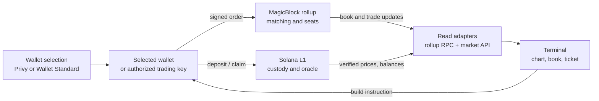
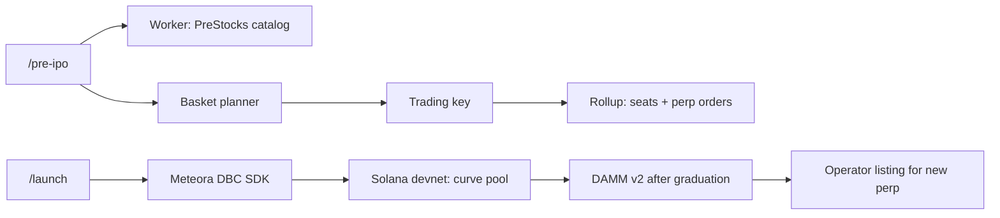

# Frontend guide

The Equinox frontend is a Next.js App Router app deployed with vinext on Cloudflare Workers. This guide covers `app/` together with the sibling `features/`, `components/`, and `lib/` directories. The [root README](../README.md) explains the complete system.

## Routes

| Route | Main implementation |
| --- | --- |
| `/` | Landing page in `features/landing/` |
| `/trade` | Chart, order book, ticket, positions, and live rollup activity in `features/trading/` |
| `/pre-ipo` | PreStocks-priced markets and baskets in `features/pre-ipo/` |
| `/launch` | Meteora launch and trading flows in `features/launch/` |
| `/portfolio`, `/activity` | Wallet holdings, positions, and transaction history |
| `/settings`, `/diagnostics` | Session controls and observable protocol state |

The terminal's market picker reads the deployment manifest, with `?market=SYMBOL` selecting a market. Page files in `app/` are thin; most behavior belongs to a feature or a pure adapter in `lib/`.

## Data and order flow



- `components/app-providers.tsx` mounts identity and wallet selection. The app must have one selected wallet before it treats a session as authenticated.
- `features/trading/use-v3-book.ts` reads the delegated book directly and can fall back to the Market API aggregate when the direct read is unavailable. `features/trading/order-book.tsx` renders stable rows and animates only changed values.
- `clients/equinox/src/abi/` owns instruction encoding and V3 account decoding. UI components should not guess byte offsets.
- `app/api/auth/` and `app/api/relay/session/` are same-origin server routes. Service credentials remain server-side. The browser signs trading actions with its selected wallet or authorized trading key, depending on the active path.
- Theme colors and type live in `app/globals.css`; `components/layout/` owns shared navigation and status chrome.

The older [frontend architecture notes](../docs/frontend-architecture.md) explain wallet selection and adapter boundaries in depth. For the current live behavior and open issues, start with [the dated status snapshot](../docs/status/current.md).

## Pre-IPO and launch flows

The sponsor pages use the same wallet selection and trading-key path as `/trade`, but their source data and chain actions differ:

| Flow | Read path | Signed action | Boundary to keep clear |
| --- | --- | --- | --- |
| PreStocks catalog | Worker `GET /v1/pre-ipo` proxies issuer data; the market-maker status supplies reporter and perp prices. | Token links open external mainnet trading; Equinox perp orders use the rollup. | Mainnet tokens and devnet perps are separate assets. |
| Pre-IPO basket | `features/pre-ipo/` plans whole-share legs and shows estimated margin. | Authorized trading key creates missing seats, funds isolated margin, and submits each leg. | A basket is multiple market orders, each with its own result. |
| Meteora launch | `features/launch/` reads curve presets and launch registry data. | Trading key creates a DBC config/pool and signs curve buys or sells on Solana devnet. | A graduated DAMM v2 pool does not automatically appear in the perp selector. |



The market picker and per-market address resolution come from [`config/equinox-deployment.json`](../config/equinox-deployment.json). For a new market, update the manifest and shared ABI/account wiring before exposing it in the terminal. The [root sponsor section](../README.md#sponsor-add-ons-and-integrations) explains the pricing trust model and listing step.

## Local development

From the repository root:

```bash
npm install
npm run dev
```

The page renders without a Privy app ID, with wallet actions unavailable. Use an untracked `.env.local` to enable live integrations. [`.env.example`](../.env.example) covers the base configuration; the main groups are:

| Need | Configuration |
| --- | --- |
| Privy login | `NEXT_PUBLIC_PRIVY_APP_ID` plus server-only `PRIVY_APP_SECRET` |
| Market reads | `NEXT_PUBLIC_EQUINOX_MARKET_API_URL` and the public devnet deployment manifest |
| Wallet transactions | `NEXT_PUBLIC_SOLANA_RPC_URL` with a public, browser-safe endpoint |
| Session relay | Server-only `EQUINOX_RELAYER_URL` and `EQUINOX_RELAYER_TOKEN`, plus the relayer's public address |
| Market-maker activity | `NEXT_PUBLIC_MM_STATUS_URL` for the service's HTTPS status and event stream |

`NEXT_PUBLIC_` values ship to the browser. Do not put API keys, keypairs, or private RPC credentials there. The Worker, market maker, and Solana deployment have separate setup steps in their READMEs.

## Where to make a change

| Task | Start here |
| --- | --- |
| Trading UI or live book | `features/trading/` |
| Wallet choice and sign-in | `components/app-providers.tsx`, `components/wallet-selection-context.tsx` |
| Session authorization | `features/sessions/`, `lib/trading-key.ts` |
| RPC and market state | `features/magicblock/`, `lib/v3-aggregate.ts` |
| Instruction or account layout | `clients/equinox/src/abi/` and `programs/equinox/` together |
| Shared visuals | `app/globals.css`, `components/layout/` |

The root `package.json` contains the build, lint, unit, and browser scripts. The [test guide](../docs/testing.md) distinguishes local checks from live devnet evidence.
