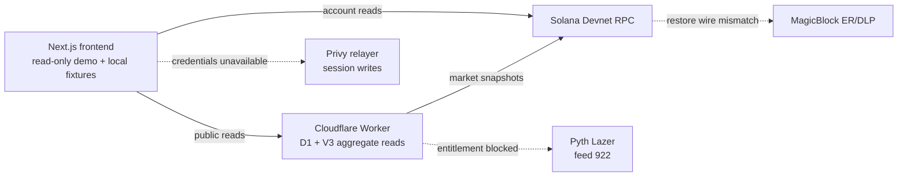

# StockStream hackathon submission package

## Product

StockStream is a Solana tokenized-stock perpetuals exchange prototype for
deterministic, risk-checked execution. Its V3 design uses paged order books,
sharded seats/events, session authorization, and an explicit L1/MagicBlock
execution boundary. The demo deliberately separates verified Devnet reads
from local deterministic trading fixtures.

## Demo links

- GitHub: https://github.com/Ansh-699/StockStream/tree/stockstream/takeover-ee3c5f6
- Live read-only Worker: https://stockstream-market-api.ansht.workers.dev/health
- Live read-only markets: https://stockstream-market-api.ansht.workers.dev/v1/markets
- Frontend diagnostics: `/diagnostics` in the deployed frontend

## Architecture

## Demo walkthrough

1. Open the frontend on Devnet and select **Diagnostics**. Confirm the
   preserved V3 core, immutable deployed program, artifact mismatch, Worker
   health, Pyth entitlement, Privy relay, and MagicBlock status.
2. Open **Trade**. The banner identifies the known V3 core, read-only Devnet
   state, and the unavailable live capabilities. The empty `/v1/markets`
   response is expected; the configured core remains available for the V3
   read path.
3. Use the deterministic fixture mode to show order-ticket, session, nonce,
   cancel/replace, reduce-only, lifecycle, and withdrawal safety states.
4. Explain that no live order, relay, restoration, or withdrawal is claimed.
   The source/local verification counts and Devnet deployment identity are
   linked below.

## Honest limitations

- The deployed ELF (`034b3088…`) does not match the current local artifact
  (`69b7fb51…`); the deployed source commit is not proven.
- Pyth `Equity.US.AAPL/USD` feed 922 is catalog-visible but not entitled.
- No fresh Privy access token or expected linked wallet is available.
- Cloudflare production secret deployment is externally blocked by missing API
  authorization.
- MagicBlock restoration is blocked by the deployed DLP wire-version mismatch.
- The preserved V3 core is not mutated and live trading, relay, restoration,
  and withdrawal are not claimed.

## Evidence

- [Current status](../status/current.md)
- [Release alignment](../status/release-alignment-20260921.json)
- [Fresh verification gate](../status/verify-latest.json)
- [Deployment verification](../status/deployment-verification-20260921.json)
- [MagicBlock evidence](../status/magicblock-v3-repro-20260921.json)
