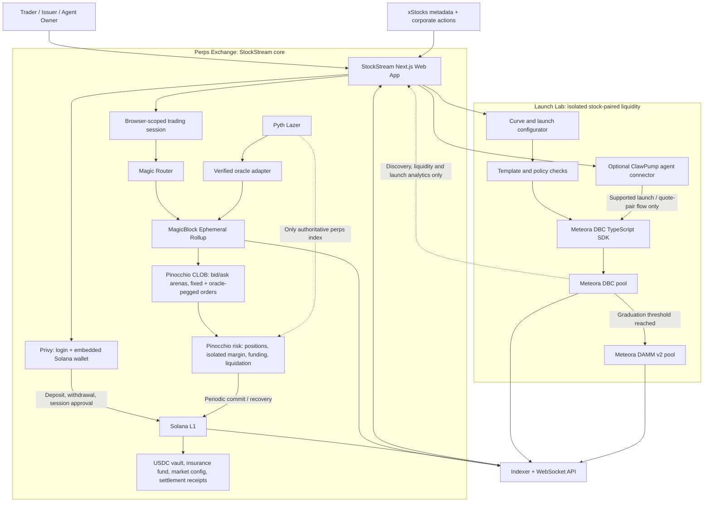
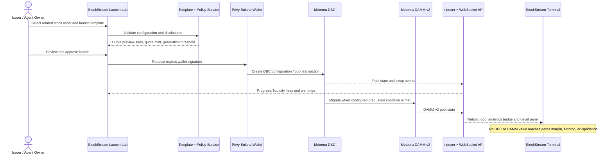

# StockStream — Updated Architecture and Product Experience

**Document type:** Product and technical architecture — Version 2  
**Project:** StockStream  
**Positioning:** A retail-friendly stock perpetuals exchange with a stock-paired launch and liquidity lab on Solana  
**Core technologies:** Pinocchio, MagicBlock Ephemeral Rollups, Privy, Pyth Lazer, Meteora DBC, ClawPump, USDC  
**Target:** Stocklana Hackathon 2026  
**Status:** Discussion-phase architecture; not an implementation specification  
**Updated:** September 15, 2026 — perps + Launch Lab architecture revision

---

## 1. Executive summary

StockStream is a browser-first perpetual-futures exchange for tokenized equities on Solana. Users deposit USDC, then take long or short exposure to stocks such as Apple, Tesla, Nvidia, or broad-market ETFs. Orders are matched through an onchain central limit order book rather than against a conventional centralized matching server.

The latency-sensitive state—order books, active orders, positions, funding state, and market risk state—is delegated to a MagicBlock Ephemeral Rollup. This provides a responsive trading experience while retaining Solana-native programs and settlement. Durable configuration, collateral custody, withdrawals, and final settlement remain anchored to Solana.

The program is built with Pinocchio to minimize framework overhead and provide explicit control over account parsing, memory layout, compute consumption, and cross-program interactions. Privy provides email/social onboarding and an embedded Solana browser wallet, while a tightly scoped browser session signer handles frequent trading actions without repeated approval prompts.

The primary consumer wedge is not merely “stock perps.” It is **one-click hedging for people who already own tokenized stocks on Solana**. A user can connect a wallet, see an existing xStocks position, and open a corresponding short perpetual without selling the spot asset.

StockStream also has an isolated **Launch Lab**: an issuer or agent configures a stock-paired token launch, creates and monitors a Meteora Dynamic Bonding Curve (DBC) pool, and tracks its migration to DAMM v2 liquidity. ClawPump is the optional agent-launch connector. This lane adds stock-paired liquidity and launch tooling; it never replaces or writes to the perpetuals matching, margin, or liquidation engine.

---

## 2. Hackathon relevance

StockStream maps directly to the Stocklana themes:

- **Trading:** a 24/7 stock-focused venue and onchain order book.
- **Credit and yield:** USDC-margined structured exposure through perpetual contracts.
- **Infrastructure:** low-latency matching, stock-aware oracles, funding, and corporate-action processing.
- **Consumer:** browser-native onboarding, simple long/short controls, and portfolio hedging.
- **Meteora bounty:** equity-aware DBC configuration and a practical monitor for stock-paired launch pools.
- **ClawPump bounty:** an agent can launch and manage a stock-paired token/pool, subject to the quote-pair support exposed by ClawPump at launch time.

The strongest submission narrative is:

> Tokenized stocks provide spot ownership on Solana, but holders still lack a simple way to hedge downside, gain short exposure, or discover transparent onchain liquidity. StockStream combines a low-latency stock-perpetual CLOB with an equity-aware DBC Launch Lab, USDC collateral, MagicBlock execution, and Privy onboarding.

The project must remain visibly connected to real tokenized equities. If it only assigns stock ticker names to a generic perpetual engine, it risks appearing unrelated to the core Stocklana problem.

---

## 3. Product definition

### 3.1 Primary users

- Existing holders of xStocks or other supported tokenized equities.
- International retail users seeking self-custodial stock exposure.
- Active traders seeking long and short equity exposure.
- Tokenized-stock holders who want to hedge without selling.
- Market makers seeking a low-latency Solana-native venue.

### 3.2 Core user problems

- Spot tokenized-stock holders cannot easily hedge temporary downside.
- Existing DeFi interfaces are complex for retail users.
- Conventional onchain order books can feel slow during active trading.
- Stock markets close while onchain markets continue trading.
- Corporate actions can invalidate prices, quantities, and resting orders.
- Thin order books require efficient market-maker repricing.
- Wallet popups make rapid order management impractical.

### 3.3 Product promise

StockStream should make three promises:

1. **Simple:** log in, deposit USDC, select a stock, and choose Long or Short.
2. **Fast:** orders, cancellations, and fills run through delegated MagicBlock state.
3. **Verifiable:** order-book state, positions, risk checks, and settlement follow a Solana program rather than a hidden centralized matching engine.

---

## 4. Scope boundaries

### 4.1 Hackathon scope

The submission should demonstrate:

- One production-quality stock-perpetual market.
- One additional market shown as upcoming or experimental.
- USDC as the only collateral asset.
- Isolated margin per market.
- Limit orders, marketable limit orders, post-only orders, and cancellation.
- Long and short positions.
- Basic funding.
- Initial and maintenance margin.
- Liquidation or a complete liquidation simulation.
- A delegated MagicBlock order book.
- Privy browser-wallet onboarding.
- A scoped browser trading session.
- Live order-book depth and recent fills.
- One-click hedge calculation from a detected tokenized-stock holding.
- Corporate-action and market-hours safety states.
- Measured transaction and matching latency.
- One DBC launch template designed for an equity-adjacent asset.
- DBC pool creation or a verifiable mainnet/devnet transaction flow, with curve, fees, quote token, and graduation settings visible.
- A Launch Lab monitor for pool state, curve progress, fees, liquidity, and DAMM v2 graduation.
- An optional ClawPump agent-launch flow, only when the required stock quote pair is available through its supported integration surface.

### 4.2 Explicit non-goals

Do not attempt during the hackathon:

- Cross-margin across all markets.
- Multiple collateral assets.
- Options or dated futures.
- Lending and borrowing.
- A private or dark order book.
- Native mobile applications.
- Cross-chain settlement.
- Automatic real-money copy trading.
- AI-generated investment advice.
- Production leverage above conservative demo limits.
- Unattended server control over user funds.
- Custody of xStocks inside the matching engine.
- Use of a DBC pool price as the perpetual index, collateral valuation, funding index, or liquidation mark.
- A claim that a newly created SPL token represents an actual share unless an authorized issuer, backing, transfer restrictions, and compliance process exist.

---

## 5. System architecture



### 5.1 Architectural principle

The system has two execution temperatures:

- **Cold state:** infrequently changed, durable, security-sensitive state on Solana.
- **Hot state:** frequently changed market state delegated to MagicBlock.

This separation prevents deposits and withdrawals from sharing the same latency and lock requirements as order placement and matching.

### 5.2 Three-plane boundary model

StockStream is intentionally composed of three planes with one-way data boundaries:

| Plane | Frameworks and services | What it owns | What it must not do |
| --- | --- | --- | --- |
| Perps execution | Pinocchio, MagicBlock ER, Magic Router, Pyth Lazer, Solana | CLOB, positions, USDC margin, funding, liquidation, L1 settlement | Read DBC spot price as a risk index or allow Launch Lab actions to alter trader state |
| Launch and liquidity | Meteora DBC, DAMM v2, DBC TypeScript SDK, optional ClawPump connector | Launch configuration, curve transactions, pool state, graduation and fee monitoring | Custody perps collateral, create perps positions, or bypass issuer/pool-owner approvals |
| Experience and data | Next.js, TypeScript, Privy, indexer, WebSocket/SSE delivery | Login, wallet UX, terminal, Launch Lab, unified read models | Hold private keys, independently execute a trade, or declare a DBC token to be a real stock |

The DBC pool may be shown beside a related perpetual market as a liquidity/discovery signal. Pyth Lazer remains the only authoritative price path for perps risk decisions. No cross-program instruction from Meteora or ClawPump is required by the Pinocchio perps program.

### 5.3 Framework selection

- **Onchain perps program:** native Rust with Pinocchio. It preserves explicit account parsing, fixed layouts, checked integer math, and the existing custom orderbook design.
- **Low-latency execution:** MagicBlock Ephemeral Rollups plus Magic Router. Delegated market accounts use ER-aware transaction routing; durable collateral and recovery stay on Solana L1.
- **Web application:** Next.js App Router, React, TypeScript, and Tailwind CSS. This keeps the terminal, issuer console, wallet UI, and server-side read endpoints in one deployable application.
- **Wallet and authentication:** Privy React SDK with Solana embedded wallets and external-wallet support. Privy signs deposits, withdrawals, and explicit launch approvals; the browser-scoped session signer is only for allowed perps instructions.
- **Oracle path:** Pyth Lazer feed client plus a minimal verified adapter inside the delegated execution environment. Equity session/status and freshness checks are enforced before risk-changing actions.
- **DBC integration:** a server-side TypeScript service built on `@meteora-ag/dynamic-bonding-curve-sdk`, which constructs simulations and unsigned transactions; the connected Privy wallet signs the final launch actions.
- **Agent integration:** ClawPump MCP/API connector behind a small adapter. It is feature-gated until the current ClawPump API confirms the required stock quote mint/pair; no agent receives access to user perps sessions or USDC vault authority.
- **Read model:** TypeScript indexer using a managed Solana RPC/WebSocket feed, MagicBlock ER subscription path, and Meteora account/event reads. It writes an append-only event stream and query-optimized database views for the UI; it is not part of matching or settlement.

### 5.4 Commit cadence and finality disclosure

The proposed delegation configuration uses `commit_interval_ms = 30_000`, meaning the ER requests a base-layer commit every 30 seconds by default. An ER confirmation is therefore not represented to the user as immediate Solana L1 finality. The interface must display both the latest ER sequence and the latest committed L1 sequence.

The interval is configurable, but 30 seconds is the documented default for this architecture and must be used consistently in demo measurements, recovery assumptions, and withdrawal timing. A withdrawal may need to wait for a fresh commit and undelegation before collateral becomes withdrawable on L1.
---

## 6. Solana base-layer responsibilities

Solana remains authoritative for:

- Exchange configuration.
- Market creation and activation.
- Program upgrade and emergency authorities.
- Accepted collateral mint.
- USDC deposits and withdrawals.
- Insurance-fund custody.
- Deposit credits before delegation.
- Withdrawal claims after undelegation.
- Market status and emergency pause.
- Durable snapshots committed from MagicBlock.

### 6.1 Why custody remains on L1

Real collateral should not depend on the availability of a low-latency execution session. Users must retain a clear recovery path if:

- The Ephemeral Rollup is temporarily unavailable.
- The browser loses its session.
- The market is paused.
- A corporate action requires close-only mode.
- A market must be force-settled.

The withdrawal path therefore requires an authoritative committed balance rather than trusting a browser or offchain service.

---

## 7. MagicBlock responsibilities

The Ephemeral Rollup processes:

- Order placement.
- Order cancellation.
- Cancel-and-replace.
- Price-time matching.
- Position updates.
- Locked and available margin updates.
- Realized and unrealized PnL calculations.
- Funding-index updates.
- Liquidation eligibility checks.
- Market status checks.
- Fill and event creation.

### 7.1 Delegation boundary

Each market should have one authoritative delegated execution session. For example:

- AAPL-PERP delegates to one selected MagicBlock validator.
- TSLA-PERP may delegate independently.
- SPY-PERP may delegate independently.

A single order book should not be active on multiple validators at the same time. Horizontal scaling occurs between markets rather than by splitting one price-time sequence across execution environments.

### 7.2 Why one market is sequential

A price-time-priority CLOB is fundamentally ordered. If two orders arrive close together, one must receive sequence priority. Parallel mutation of one book can create fairness and determinism problems. A single delegated write boundary is therefore acceptable, provided its runtime is fast.

---

## 8. Recommended order-book architecture

### 8.1 Selected approach: two side arenas

The market uses **two independent node arenas**:

1. **Bid arena** — one shared node array with a `Fixed` root and an `OraclePegged` root.
2. **Ask arena** — one shared node array with a `Fixed` root and an `OraclePegged` root.

Fixed and oracle-pegged orders therefore do not require four separate allocations. They share storage per side while retaining separate roots and ordering semantics. This follows the Serum/OpenBook-style shared node-arena model. It is not attributed to Manifest: Manifest's Hypertree uses red-black trees and rotation-based balancing, which is a materially different design.

Trader seats, risk state, funding state, and the event ring are market-account regions outside these two order-tree arenas. “One market account” must not be confused with “one order-tree arena.”

### 8.2 Terminology: prefix-length binary trie (PATRICIA trie)

The recommended index is a **prefix-length binary trie**, commonly described as a PATRICIA trie. Each inner node stores the number of key-prefix bits shared by every descendant. The next differing bit selects the left or right child. Leaves contain complete 128-bit order keys.

The Solana ecosystem often calls this structure a **critbit tree** because Serum placed the implementation in a file named `critbit.rs`. That filename became common vocabulary. OpenBook v2 is more literal: its source describes the structure as a binary tree over `AnyNode::key()` and names the modules `ordertree` and `ordertree_iterator`. This document uses “prefix-length binary trie (PATRICIA trie)” because it describes the actual layout without depending on a historical filename.

This is not a pointer-heavy general-purpose tree. It is an intrusive, fixed-capacity, zero-copy tree whose child references are integer indexes into an account-owned node array.

### 8.3 Composite price-time key

Every leaf is ordered by a 128-bit key:

- High 64 bits: fixed-price data or encoded oracle-price offset.
- Low 64 bits: sequence-derived time priority.

Bid ordering is encoded so the best bid is encountered first; asks use ascending price order. At the same comparable price, the earlier sequence wins.

This gives deterministic price-time priority without storing linked FIFO queues for every price level.

### 8.4 Actual 88-byte node envelope

All arena slots have the same 88-byte `AnyNode` envelope. A slot can be interpreted as an inner node, leaf node, free node, or last-free node according to its tag.

The OpenBook-derived inner-node layout relevant to StockStream is:

| Field | Type | Purpose |
| --- | --- | --- |
| `tag` | `u8` | Identifies an inner node |
| `padding` | byte padding | Preserves zero-copy alignment |
| `prefix_len` | `u32` | Number of common high-order key bits |
| `key` | `u128` | Representative key used for prefix comparison |
| `children` | `[u32; 2]` | Arena indexes for the zero-bit and one-bit branches |
| `child_earliest_expiry` | `[u64; 2]` | Earliest expiry reachable through each child |
| reserved/padding | bytes | Completes the fixed 88-byte envelope |

`child_earliest_expiry` is operationally important for stock markets. It allows expiry sweeping to prune branches whose minimum expiry is still in the future and descend first into a branch that may contain expired orders. At a market-session transition or corporate-action freeze, the engine can remove expired orders without scanning every leaf.

Whenever a leaf is inserted, removed, or its ancestry changes, the cached earliest-expiry value must be updated along the affected path. Incorrect cache maintenance is a safety bug because it can leave stale orders visible or create unnecessary traversal.

### 8.5 Capacity and account budget

The proposed capacity is fixed and explicit:

| Region | Unit size | Capacity | Budget |
| --- | ---: | ---: | ---: |
| Bid arena nodes | 88 bytes | 1,024 nodes | 90,112 bytes raw nodes |
| Bid arena metadata/reserve | — | — | 528 bytes |
| **Bid arena total** | — | — | **90,640 bytes** |
| Ask arena nodes | 88 bytes | 1,024 nodes | 90,112 bytes raw nodes |
| Ask arena metadata/reserve | — | — | 528 bytes |
| **Ask arena total** | — | — | **90,640 bytes** |
| Both order arenas | — | 2,048 nodes | **181,280 bytes** |
| Trader seats and position state | fixed-size region | implementation cap | budgeted separately |
| Event/fill ring | fixed-size region | implementation cap | budgeted separately |
| Market header, funding, risk, reserves | fixed-size region | one | budgeted separately |
| **Estimated complete market account** | — | — | **approximately 0.62 MB** |

The 1,024-slot capacity is per side and includes inner, leaf, and free-node representations. It does not mean 1,024 simultaneously live orders: inner nodes consume slots as the trie branches. The UI and market maker must therefore read live capacity rather than assume the raw slot count equals available order count.

### 8.6 Allocation and free list

The arena uses a bump index until untouched slots are exhausted, then reuses removed slots through an intrusive free list. No runtime heap collection is used in the matching path.

Relevant invariants include:

- Every allocated slot is reachable from exactly one root or is explicitly owned by another arena structure.
- Every free slot appears exactly once in the free list.
- A slot cannot be both reachable and free.
- Root leaf counts match traversal results.
- Child handles remain within the 1,024-slot bound.
- Both roots on one side share the same allocator and cannot allocate the same slot.

### 8.7 Why not a sorted array

A sorted array provides simple best-price access but requires shifting entries during insertion and deletion. That cost is especially poor for frequently repriced market-maker orders.

### 8.8 Why not a heap

A heap finds the best order efficiently but performs poorly for arbitrary cancellation and FIFO traversal unless paired with another lookup structure.

### 8.9 Why not Manifest's red-black tree

Manifest's shared-node Hypertree is sophisticated and memory-conscious, but red-black insertion and deletion require rotations, parent maintenance, and color invariants. StockStream instead adopts the Serum/OpenBook prefix-length trie because its 128-bit price-time key, separate fixed/pegged roots, and expiry cache already match the required order semantics.

### 8.10 Bounded matching and expiry sweeping

Every instruction limits:

- Number of maker fills.
- Number of invalid orders removed.
- Number of expired leaves swept.
- Number of event entries emitted.

At a stock-market close, halt, or corporate action, sweeping is incremental. `child_earliest_expiry` makes each step targeted, but the protocol still avoids claiming that an entire large book can always be cleaned in one instruction.
---

## 9. Oracle-pegged liquidity

Oracle-pegged orders are the primary repricing optimization. A maker stores an oracle offset, quantity, expiry, and peg boundary instead of cancelling and replacing the quote after every oracle update.

### 9.1 Two roots per side

Each side arena has two logical roots:

- `Fixed`
- `OraclePegged`

The matcher merges the best candidates from both roots. Across the market there are four logical order trees, but only two physical arenas.

### 9.2 Cross-tree FIFO normalization

Fixed and pegged roots encode different high 64-bit price data: one contains an absolute price and the other an oracle offset. Their raw 128-bit keys therefore cannot be compared directly after an oracle price is applied.

The OpenBook iterator resolves this with `key_for_fixed_price()`: it normalizes the candidate's effective price into the fixed-price key domain while preserving the original sequence component. Ranking then compares normalized price-time keys.

Consequently, if:

- A pegged order was placed at time/sequence T1,
- A fixed order was placed later at T2,
- Both have the same current effective price,

then the pegged order at T1 ranks first. Oracle repricing does not silently reset FIFO priority. This rule must be reproduced exactly in tests spanning both roots.

### 9.3 Three-state pegged-order model

A pegged iterator result is not simply “valid” or “invalid.” It has three states:

| State | Meaning | Matching behavior | UI behavior |
| --- | --- | --- | --- |
| **Valid** | Oracle exists, order is unexpired, effective price is within the peg limit | Eligible to match and display as executable depth | Render normally |
| **Invalid** | The order can no longer be honored, such as expiry or peg-limit violation | Not executable; eligible for removal according to protocol rules | Remove from executable depth; show owner as expired/invalid until cleanup |
| **Skipped** | A current effective price cannot be ranked, commonly because the oracle price is unavailable | Temporarily omitted without declaring the stored order permanently invalid | Hide from executable depth; show owner as suspended/pending oracle, not cancelled |

This distinction prevents the frontend from telling a user that an order was cancelled when it was only skipped because the oracle was unavailable. Snapshot and delta messages must preserve the state or enough cause information to reconstruct it.

### 9.4 Effective price and peg boundary

The effective price is derived from the current oracle price plus the signed order offset. A peg limit prevents a maker from executing beyond the accepted boundary.

- If the effective price remains within the boundary, the order may be `Valid`.
- If it violates the boundary or has expired, it is `Invalid`.
- If no usable oracle price exists, it is `Skipped`.

Arithmetic must use checked fixed-point operations and reject overflow before ranking.

### 9.5 Matching across roots

For a taker, the engine:

1. Reads the best fixed candidate on the opposite side.
2. Reads the best oracle-pegged candidate.
3. Converts the pegged candidate to an effective price.
4. Normalizes comparable keys with the fixed-price key representation.
5. Applies the three-state filter.
6. Selects the best valid price, using original sequence for equal-price FIFO.
7. Executes within the instruction's fill bound.

### 9.6 Why this matters for high-frequency repricing

- Makers update fewer orders.
- Oracle movement changes effective quotes without account rewrites.
- Fixed and pegged liquidity compete under one price-time rule.
- FIFO remains deterministic across roots.
- Missing oracle data suspends rather than incorrectly destroys orders.
- Expired/invalid orders can be cleaned incrementally.
---

## 10. Trader seats and inline settlement

### 10.1 The unknown-maker problem

A taker order can match several makers. On Solana, writable accounts normally must be declared before execution. If every maker has a separate writable position account, the client must predict which makers will fill the order.

That prediction can become invalid before the transaction executes.

### 10.2 Selected solution

For the first version, use compact isolated-margin trader seats within the delegated market arena.

Each seat contains enough information to update a fill:

- Trader identity or compact identity index.
- Available margin.
- Locked margin.
- Signed position quantity.
- Entry-value accumulator.
- Realized PnL.
- Last funding index.
- Open-order exposure.
- Liquidation state.

The matching engine can update the maker and taker inside the same market account without requiring an unpredictable list of maker accounts.

### 10.3 Trade-off

Advantages:

- One predictable writable market account.
- Immediate position updates.
- No delayed maker settlement crank.
- Fast MagicBlock routing.
- Simple browser transaction construction.

Disadvantages:

- Fixed market capacity.
- Isolated rather than cross-market margin.
- Large account size.
- Strong need for efficient snapshot and delta delivery.

This is the correct trade-off for the hackathon and for proving the low-latency design.

---

## 11. Perpetual risk model

### 11.1 Collateral

USDC is the only accepted collateral in the first version.

Reasons:

- Stable unit of account.
- Clear user mental model.
- Simpler risk calculations.
- No collateral-oracle dependency.
- Easier liquidation and withdrawal accounting.

### 11.2 Isolated margin

Every market has an independent collateral allocation. Losses in one stock market cannot automatically consume collateral allocated to another market.

Cross-margin is deferred because it creates:

- Cross-market account locking.
- More complex liquidation behavior.
- Portfolio correlation assumptions.
- Higher systemic-risk surface.

### 11.3 Position direction

- Positive signed quantity represents a long.
- Negative signed quantity represents a short.
- Zero represents no position.

### 11.4 Account equity

The risk engine evaluates:

- Deposited collateral.
- Realized PnL.
- Unrealized PnL.
- Funding owed or receivable.
- Trading fees.
- Reserved open-order margin.

### 11.5 Margin requirements

The user interface must show:

- Initial margin.
- Maintenance margin.
- Available margin.
- Margin utilization.
- Estimated liquidation price.
- Maximum additional order size.

Use conservative demo leverage such as 3× or 5×. Higher leverage adds little hackathon value and greatly increases risk complexity.

### 11.6 Liquidation

A position becomes liquidatable when account equity falls below maintenance requirements.

The liquidation process should:

- Use a validated mark or index price.
- Cancel exposure-increasing open orders.
- Reduce the position.
- Apply a transparent liquidation penalty.
- Credit part of the penalty to the liquidator or keeper.
- Credit part to the insurance fund.
- Prevent liquidation from increasing risk.

A complete simulated liquidation on devnet is sufficient for the hackathon if clearly demonstrated.

---

## 12. Mark, index, and execution prices

StockStream must distinguish:

- **Index price:** external reference for the underlying stock.
- **Mark price:** bounded risk price used for PnL and liquidation.
- **Order-book price:** bid, ask, midpoint, or last fill.
- **Execution price:** actual price at which a trade fills.
- **Tokenized-stock spot price:** onchain xStock market price when available.

The mark price should not blindly follow the last fill because a small manipulated trade could trigger liquidations.

A robust approach bounds the order-book-derived price around a validated index and uses additional checks for confidence, age, and deviation.

---

## 13. Pyth Lazer market-state integration

Pyth Lazer and the MagicBlock Oracle Adapter are separate components. Lazer supplies signed low-latency market data; the adapter verifies/translates the update into program-consumable state inside the MagicBlock execution environment.

The integration must consume both price data and explicit market metadata.

### 13.1 Source enums

The relevant session and status values are:

```text
MarketSession { Regular, PreMarket, PostMarket, OverNight, Closed }
TradingStatus { Open, Closed, Halted, CorpAction }
```

`MarketSession` describes where the instrument is in its trading-day lifecycle. `TradingStatus` is the stronger operational condition. For example, a feed may be in a regular session while trading is halted; `Halted` must override the otherwise normal session.

### 13.2 Protocol-mode mapping

| Pyth `TradingStatus` | Pyth `MarketSession` | StockStream mode | New exposure | Reduce/close | Pegged orders |
| --- | --- | --- | --- | --- | --- |
| `Open` | `Regular` | Normal | Allowed | Allowed | Valid if price passes freshness/confidence/peg checks |
| `Open` | `PreMarket` | Extended | Allowed with reduced limits | Allowed | Valid under extended-hours risk bands |
| `Open` | `PostMarket` | Extended | Allowed with reduced limits | Allowed | Valid under extended-hours risk bands |
| `Open` | `OverNight` | Extended/Restricted | Configurable; conservative limits | Allowed | Valid only with fresh eligible feed and wider safeguards |
| `Open` | `Closed` | Close-only | Disallowed | Allowed when a defensible mark exists | Skipped if no current usable oracle |
| `Closed` | any | Close-only | Disallowed | Allowed only under configured safe mark | Skipped or invalid according to order condition |
| `Halted` | any | Paused or close-only | Disallowed | Protocol-configured risk reduction only | Skipped; no normal pegged matching |
| `CorpAction` | any | Corporate-action freeze | Disallowed | Only controlled settlement/adjustment | Invalidated or suspended pending adjustment policy |

### 13.3 Oracle acceptance checks

A price is usable only if all configured checks pass:

- Expected feed identity.
- Signature/adapter verification.
- `feedUpdateTimestamp` freshness, not just the outer message timestamp.
- Supported `MarketSession`.
- `TradingStatus == Open` for normal risk-increasing activity.
- Confidence and deviation thresholds.
- Monotonic update ordering.
- No arithmetic overflow during exponent conversion.

A fixed-rate stream can repeat a prior value while the market is closed. Therefore, receiving a new message is not by itself proof of a fresh equity price.

### 13.4 User-interface requirements

Every market page shows:

- Session: Regular, Pre-market, Post-market, Overnight, or Closed.
- Trading status: Open, Closed, Halted, or Corporate Action.
- Feed update age.
- Current protocol mode.
- Whether fixed and oracle-pegged orders are executable.

The UI must not flatten `Halted`, `CorpAction`, and a routine `Closed` session into the same generic “market closed” label.
---

## 14. Corporate actions

A stock-perpetual venue must explicitly handle:

- Cash dividends.
- Stock dividends.
- Forward splits.
- Reverse splits.
- Trading halts.
- Symbol or corporate-identity changes.
- Delisting or unsupported oracle state.

### 14.1 Corporate-action transition

Recommended process:

1. Detect the announced event from issuer metadata.
2. Schedule a transition timestamp.
3. Enter close-only or paused mode before activation.
4. Stop accepting new pegged and fixed exposure-increasing orders.
5. Cancel or invalidate resting orders that use the old economic scale.
6. Apply an adjustment that preserves each trader’s notional and PnL.
7. Validate the post-action oracle and tokenized-stock reference.
8. Reopen in close-only mode.
9. Resume normal trading after integrity checks.

### 14.2 Product value

Corporate-action handling is not only a safety requirement; it is a major Stocklana differentiator. The demo should include a simulated split or dividend transition.

---

## 15. Funding

Funding keeps the perpetual mark near the stock index.

The market maintains a cumulative funding index rather than iterating over all traders. Each seat records the last funding index applied to its position.

Funding design principles:

- Positive premium generally causes longs to pay shorts.
- Negative premium generally causes shorts to pay longs.
- Funding rates are capped.
- Stale or unavailable index prices halt new funding calculations.
- Extended-hours funding may use stricter caps or pause entirely.
- Funding cannot overflow the position or collateral representation.

For the demo, a short funding interval can illustrate behavior, while the documentation explains that production intervals would be longer.

---

## 16. Market-maker strategy

A CLOB without liquidity is not a usable application. One reliable market maker is required for the demo.

The maker should:

- Read the validated index price.
- Post oracle-pegged bids and asks.
- Widen spread when volatility or uncertainty rises.
- Reduce quote size as inventory exposure grows.
- Stop quoting when the oracle is stale.
- Stop quoting during corporate-action transitions.
- Respect position and loss limits.
- Reconnect and resynchronize after missed events.

The demo must not disguise synthetic liquidity as organic user activity. It should identify the designated demo maker.

---

## 17. Market-data architecture

### 17.1 Avoid full-account updates

A large single market account is efficient for predictable matching but inefficient if the browser downloads the entire account after every order.

The UI should use:

- An initial order-book snapshot.
- Compact sequential deltas.
- Periodic checksums or sequence validation.
- Full resynchronization after a gap.

### 17.2 Snapshot contents

- Market sequence number.
- Bid and ask levels.
- Individual visible orders when required.
- Recent fills.
- Mark and index prices.
- Funding state.
- Open interest.
- Market mode.

### 17.3 Delta contents

- Sequence number.
- Order inserted.
- Order quantity reduced.
- Order removed.
- Fill executed.
- Best bid or ask changed.
- Funding state changed.
- Market mode changed.

### 17.4 Authority

The indexer improves delivery but does not decide matches. If the indexer disagrees with the delegated market state, the program state is authoritative.

---

## 18. Privy and browser-wallet architecture

### 18.1 User onboarding

The recommended flow is:

1. User opens StockStream.
2. User logs in with email, social identity, or an existing wallet.
3. Privy creates or loads an embedded Solana wallet.
4. The application displays the wallet address and recovery/export options.
5. The user receives or deposits test USDC and SOL.
6. The user explicitly approves account creation and collateral deposit.

### 18.2 Two distinct delegations

The application must distinguish:

- **MagicBlock account delegation:** moves program-owned state execution into an Ephemeral Rollup.
- **Privy wallet delegation:** permits another authorized signer or server to act through an embedded wallet.

These are independent mechanisms. Privy does not automatically delegate program state to MagicBlock.

### 18.3 Recommended signing tiers

#### Privy main wallet

Required for:

- Deposit.
- Withdrawal.
- Creating a trader seat.
- Authorizing a browser trading session.
- Increasing session limits.
- Revoking the session.
- Emergency recovery.

#### Browser session signer

Allowed for:

- Place order.
- Cancel order.
- Cancel and replace.
- Reduce position.
- Cancel all orders.

The session must be restricted by:

- Expiration time.
- Trader identity.
- Market identity.
- Allowed instruction set.
- Maximum order notional.
- Maximum aggregate exposure.
- Nonce or replay protection.

The session must not authorize deposits, withdrawals, collateral transfers, or administrative actions.

### 18.4 Server delegation

Privy server-delegated actions are deferred. They are useful for offline stop losses or scheduled trading, but they add policy, security, and operational complexity. The hackathon trading session should remain in the browser.

---

## 19. Browser-controlled MagicBlock lifecycle

The application hides execution-layer complexity from the user.

```mermaid
sequenceDiagram
    actor User
    participant UI as Browser UI
    participant PW as Privy Wallet
    participant L1 as Solana
    participant MR as Magic Router
    participant ER as MagicBlock ER

    User->>UI: Deposit USDC
    UI->>PW: Request deposit signature
    PW->>L1: Deposit and credit trader
    L1-->>UI: Deposit confirmed

    User->>UI: Start trading session
    UI->>PW: Approve session and delegation
    PW->>L1: Authorize session and delegate state
    L1-->>MR: Delegation observed
    MR-->>ER: Delegated state becomes active

    loop Trading
        User->>UI: Place or cancel order
        UI->>MR: Session-signed transaction
        MR->>ER: Route to delegated market
        ER->>ER: Validate, match, and update
        ER-->>UI: Confirmation and delta
    end

    User->>UI: Withdraw
    UI->>PW: Confirm commit and withdrawal
    PW->>ER: Request final commit and undelegation
    Note over UI,ER: Wait for fresh commit; default cadence is up to 30 seconds
    ER->>L1: Durable state update confirmed
    UI-->>User: L1 state is now withdrawable
    PW->>L1: Withdraw available USDC
```

The browser must use account-aware Magic Router blockhash handling for delegated accounts rather than assuming a normal Solana blockhash is valid for every transaction.

---

## 20. Launch Lab lifecycle

The Launch Lab is a second, deliberately isolated user journey. It is for an issuer or an agent owner; ordinary perps traders never need to enter it.



### 20.1 Launch templates

The first release should expose templates rather than raw protocol parameters. Each template is a reviewable configuration object, not a smart contract fork:

| Template | Intended use | DBC choices shown to the issuer | Terminal output |
| --- | --- | --- | --- |
| Equity discovery | Price discovery for a newly issued, equity-adjacent token | Conservative initial curve, USDC or supported stock quote mint, modest dynamic fee, explicit graduation target | Curve progress, spot liquidity, fee rate, graduation state |
| Thin-liquidity launch | Reduce early volatility and sandwich incentives | Flatter early curve, higher early fee that decays, restricted launch window where supported | Depth estimate, volume, volatility warning |
| Agent-managed launch | An agent operates the launch workflow after owner approval | Same approved template plus agent identity, spending cap, and revocation state | Agent status, attributable fees, launch history |

The exact numeric curve and fee settings are a research/configuration problem to solve with simulations and devnet transactions. They must be stored as immutable launch parameters after creation and displayed with the pool address and transaction signature.

### 20.2 ClawPump boundary

ClawPump is a connector, not a custody or trading authority for StockStream. The application first queries the current ClawPump launch/pair capability. Only if the selected stock quote mint and launch mechanism are supported does it enable the agent flow. Otherwise the issuer can use direct Meteora DBC creation and the UI clearly marks the ClawPump bounty path unavailable.

An agent may prepare a configuration, request an owner signature, monitor a pool, and report earned fees. It may not receive a Privy trading-session credential, sign a perps order for a user, withdraw USDC collateral, or change perps market configuration.

### 20.3 Data contracts

The indexer maintains separate read models:

- **Perps stream:** `market_sequence`, best bid/ask, depth delta, fill, position, funding, margin, liquidation state, ER commit sequence, and L1 commit sequence.
- **Launch stream:** `launch_id`, issuer/agent, token mint, quote mint, DBC config, pool address, curve state, fee state, graduation state, DAMM v2 pool address, and transaction signatures.
- **Related-market mapping:** a human-reviewed mapping from a Launch Lab token or pool to a ticker/display asset. It is metadata only, never an oracle relationship.

The browser subscribes to the two streams independently so a DBC indexer delay cannot make the orderbook stale or block trading.

---

## 21. Recommended product experience

### 21.1 Experience principles

- Hide blockchain terminology until it is relevant.
- Never hide financial risk.
- Require minimal steps for normal trading.
- Make Long and Short obvious but not gamified.
- Show expected margin and liquidation consequences before submission.
- Keep advanced order-book details available without overwhelming new users.
- Explain when a market is in extended-hours, close-only, or paused mode.

### 21.2 Landing and onboarding

The landing screen should communicate:

- Trade stock exposure on Solana.
- Long or short with USDC.
- Orders matched through a low-latency onchain CLOB.
- Self-custodial browser wallet.

Primary action:

- **Start trading**

Secondary actions:

- Explore markets
- View architecture
- Read risk disclosures

After login, the user should not be asked to choose an RPC, validator, or wallet network manually.

### 21.3 Home and market discovery

Show:

- Search by company or symbol.
- Available stock-perpetual markets.
- Index price.
- 24-hour price change.
- Funding rate.
- Open interest.
- Market status.
- Spread and available depth.
- Tokenized-stock holding, when detected.

Useful sections:

- Your holdings
- Hedge your portfolio
- Most active markets
- Extended-hours markets
- Recently viewed

### 21.4 Market page

The market page should contain:

#### Market header

- Company name and symbol.
- Market mode.
- Index price.
- Mark price.
- Last execution price.
- Funding rate.
- Open interest.
- Best bid and ask.
- Measured ER latency.

#### Chart

- Price candles.
- Index and mark overlays.
- Optional xStock spot-price overlay.
- Funding markers.
- Market-hours boundaries.
- Corporate-action annotations.

#### Order book

- Bid and ask price levels.
- Aggregated size.
- Cumulative depth.
- Spread.
- User’s own orders highlighted.
- Live delta indicator.
- Snapshot sequence and connection health in an advanced panel.

#### Order form

Simple mode:

- Long / Short.
- Amount in USDC.
- Leverage.
- Market or Limit.
- Review button.

Advanced mode:

- Size in contracts.
- Limit price.
- Post-only.
- Immediate-or-cancel.
- Reduce-only when supported.
- Estimated fees.
- Required margin.
- Estimated liquidation price.
- Expected position after fill.

#### Positions and orders

- Current position.
- Entry price.
- Mark price.
- Unrealized PnL.
- Funding paid or received.
- Margin utilization.
- Liquidation price.
- Close and reduce controls.
- Open orders with cancel and replace.

### 21.5 One-click hedge experience

This is the signature Stocklana experience.

If the connected wallet owns a supported tokenized stock, show:

- Spot holding value.
- Current perpetual exposure.
- Net exposure.
- Hedge percentage.

Suggested controls:

- Hedge 25%
- Hedge 50%
- Hedge 100%
- Custom

Before submission, display:

- Short notional to be opened.
- USDC margin required.
- Chosen leverage.
- Estimated liquidation price.
- Expected net exposure.
- Funding rate and fees.

Example:

```text
AAPLx spot exposure          +1,000 USDC
Existing AAPL-PERP exposure       0 USDC
Proposed short hedge           -500 USDC
Expected net exposure          +500 USDC
Hedge ratio                         50%
```

This feature directly connects the perpetual venue to ownership of tokenized stocks.

### 21.6 Deposit experience

Deposit should be a guided action:

1. Select USDC amount.
2. Show wallet and available balance.
3. Show that funds enter the protocol collateral vault.
4. Request one Privy wallet confirmation.
5. Show Solana confirmation.
6. Credit the trader seat.
7. Offer to start a scoped trading session.

### 21.7 Session experience

Explain the session in plain language:

> Approve fast trading for this market for the next hour. The session can place and cancel orders within your selected limit, but it cannot withdraw funds.

Show:

- Expiry.
- Maximum order amount.
- Maximum exposure.
- Allowed market.
- Revoke button.

### 21.8 Withdrawal experience

Withdrawal should display explicit phases:

1. Cancel open orders.
2. Confirm or close active positions.
3. Request a final delegated-state commit.
4. Wait for L1 confirmation. With the documented `commit_interval_ms = 30_000` default, this can take up to roughly 30 seconds before additional confirmation time.
5. Undelegate trader state.
6. Calculate the L1-authoritative withdrawable balance.
7. Request Privy wallet confirmation.
8. Transfer USDC.

The UI should show `Commit requested`, `Waiting for L1`, `Undelegating`, and `Ready to withdraw` as separate states. It must never imply that an ER confirmation is already L1-final or hide the wait behind a generic spinner.

### 21.9 Risk experience

Every order review must show:

- Direction.
- Notional.
- Leverage.
- Margin required.
- Estimated fees.
- Estimated liquidation price.
- Current funding rate.
- Market mode.
- Oracle freshness.

Use warnings for:

- Extended-hours trading.
- High leverage.
- Wide spread.
- Low depth.
- Large price impact.
- Stale or uncertain index.
- Upcoming corporate action.

---

## 22. End-to-end demo journey

The ideal demo is under four minutes.

### Scene 1 — user problem

Show an AAPLx holding in the connected wallet and explain that the user wants temporary downside protection without selling.

### Scene 2 — Privy onboarding

Log in through email or social identity and load the embedded Solana wallet.

### Scene 3 — deposit

Deposit test USDC and show the Solana confirmation.

### Scene 4 — transparent delegation

Start a fast trading session. Show one concise confirmation, then display that the market is running through MagicBlock.

### Scene 5 — live order book

Show a designated market maker publishing oracle-pegged liquidity. Display bids, asks, spread, and live updates.

### Scene 6 — one-click hedge

Select “Hedge 50%.” Review the required margin and expected net exposure.

### Scene 7 — match

Submit the short order. Show:

- Order accepted.
- Matching latency.
- Fill.
- New short position.
- Updated hedge ratio.

### Scene 8 — market movement

Move or update the test oracle and show PnL and margin updating.

### Scene 9 — settlement

Close the position, commit state, and withdraw USDC.

### Scene 10 — Launch Lab

Open the issuer view. Select an approved equity-discovery template, preview the DBC curve and graduation threshold, sign the launch with Privy, then show live DBC pool progress and the DAMM v2 migration status. If enabled, show the ClawPump agent as an owner-approved operator, not as a trader or custodian.

### Scene 11 — why Solana

Conclude with:

- Onchain price-time matching.
- MagicBlock low-latency execution.
- Solana collateral custody and settlement.
- Privy retail onboarding.
- A direct use case for tokenized-stock holders.

---

## 23. Performance strategy

### 23.1 Program-level choices

- Pinocchio rather than Anchor.
- Manual account validation.
- Zero-copy account access.
- Fixed-point integer arithmetic.
- No heap allocation in the matching path.
- Two fixed-size side arenas.
- Integer indexes rather than pointers.
- Bounded matching iterations.
- Compact order and trader representations.
- Inline maker/taker settlement within market seats.

### 23.2 Network-level choices

- One authoritative ER validator per market.
- Magic Router for account-aware transaction routing.
- Direct browser-to-router trading path.
- Geographically close market-maker infrastructure.
- WebSocket deltas for live market data.
- Periodic state commits, using a disclosed 30-second default cadence, rather than a base-layer write after every order.

### 23.3 Product-level choices

- USDC-only collateral.
- Isolated margin.
- One primary market.
- Oracle-pegged maker orders.
- No server round trip in the order-placement path.
- No unpredictable maker-account list.

### 23.4 Honest latency and commit reporting

Measure separately:

- Browser construction time.
- Signing time.
- Router submission time.
- ER acceptance time.
- Matching time.
- UI update time.
- L1 commit request time.
- L1 commit confirmation time.

The architecture uses `commit_interval_ms = 30_000` by default. A sub-second ER match and a later L1 commit are different guarantees and must be displayed separately. Do not combine them into one misleading latency number or label an ER confirmation as L1 finality.

---

## 24. Failure and recovery behavior

| Failure | Product response |
| --- | --- |
| MagicBlock ER unavailable | Disable new orders; preserve read-only market state and L1 operations |
| Oracle stale | Reject new exposure and pegged-order matching |
| Market-data delta gap | Fetch a fresh snapshot |
| Browser session expired | Require Privy wallet approval for a new scoped session |
| Commit delayed | Show pending settlement and prevent duplicate withdrawal |
| Corporate action imminent | Enter close-only or paused mode |
| Market maker offline | Show low-liquidity warning; do not create fake depth |
| Privy unavailable | Preserve public market view; block signing actions |
| Risk invariant failure | Pause the market and allow controlled recovery |

---

## 25. Security and trust model

### 25.1 User-key safety

- StockStream never receives a seed phrase.
- Privy manages the embedded wallet signing experience.
- Browser sessions are temporary and narrowly scoped.
- Session authority cannot withdraw collateral.
- Sensitive actions require the main wallet.
- Users can revoke an active trading session.

### 25.2 Market safety

- Verify oracle identity and freshness.
- Bound mark-price deviation.
- Limit fills processed per instruction.
- Limit leverage and open interest.
- Enforce isolated margin.
- Protect against arithmetic overflow.
- Prevent self-trade behavior from generating artificial PnL.
- Prevent expired orders from matching.
- Cancel risk-increasing orders during liquidation.
- Preserve a recoverable L1 state.

### 25.3 Operational safety

- Publicly identify demo-only markets.
- Use test collateral for the hackathon.
- Document the designated market maker.
- Log commits and delegation transitions.
- Provide an emergency close-only mode.
- Do not market the prototype as audited or production-ready.

---

## 26. Product differentiation

StockStream should emphasize six differentiators:

1. **Stock-first risk handling:** market hours and corporate actions are first-class protocol states.
2. **Holder hedging:** existing xStocks users can calculate and open a corresponding short hedge.
3. **Onchain CLOB:** transparent price-time ordering rather than opaque centralized matching.
4. **MagicBlock execution:** order placement and matching occur in delegated Solana program state.
5. **Retail onboarding:** Privy makes the experience accessible without requiring a wallet extension.
6. **Equity-aware launch liquidity:** DBC templates and graduation monitoring make stock-paired launch mechanics visible and configurable without compromising perps risk controls.

---

## 27. Recommended build priorities

### Priority 0 — non-negotiable

- Register and prepare the submission shell.
- Define one market and one demo user journey.
- Preserve a working branch throughout development.

### Priority 1 — matching engine

- Pinocchio market state.
- Prefix-length binary trie order indexes.
- Two side arenas with Fixed and OraclePegged roots.
- Price-time priority and cross-tree FIFO normalization.
- Limit, marketable-limit, post-only, and cancel behavior.
- Valid/Invalid/Skipped pegged-order handling.
- Fixed capacity, expiry caches, and bounded matching.

### Priority 2 — risk and authorization security

- USDC collateral accounting.
- Isolated margin.
- Long/short positions.
- Initial and maintenance margin.
- PnL and funding.
- Basic liquidation.
- Session-signer authorization in the Pinocchio program.
- Session expiry, instruction allowlist, market scope, notional limit, exposure limit, and replay protection.
- Explicit prohibition on session-authorized withdrawals and collateral transfers.

### Priority 3 — MagicBlock and oracle integration

- Bid/ask market-state delegation.
- Magic Router account-aware transactions.
- Pyth Lazer to MagicBlock Oracle Adapter path.
- Session/status mapping and oracle freshness enforcement.
- `commit_interval_ms = 30_000` default.
- Commit, recovery, and undelegation.
- Actual ER and L1 latency measurements.

### Priority 4 — product experience

- Privy onboarding and main-wallet approvals.
- Trading terminal.
- Live snapshot and sequenced deltas.
- Three-state order presentation.
- Position management.
- Honest commit-wait withdrawal progress.

### Priority 5 — Launch Lab and Stocklana differentiation

- Detect a supported tokenized-stock holding.
- One-click hedge.
- Basis panel.
- Market-session and trading-status presentation.
- Corporate-action demonstration.
- Oracle-pegged market-maker liquidity.
- DBC template schema and configuration preview.
- Meteora DBC SDK simulation, unsigned-transaction build, wallet-signed create flow, and state monitor.
- DAMM v2 graduation event/state monitor.
- ClawPump connector capability check and owner-approved agent lifecycle.
- Strict read-only boundary from Launch Lab into the perps terminal.
---

## 28. Submission description

### Short version

> StockStream is a retail-friendly stock perpetuals exchange and stock-paired Launch Lab on Solana. Users can long, short, and hedge tokenized equities with USDC through a Pinocchio CLOB delegated to MagicBlock, while issuers configure and monitor equity-aware Meteora DBC liquidity through Privy.

### Problem-focused version

> Tokenized stocks give Solana users spot ownership but limited tools for hedging, short exposure, and transparent launch liquidity. StockStream adds a real-time, price-time-priority stock-perpetual order book, plus an isolated Meteora DBC Launch Lab where issuers and approved agents configure, launch, and monitor stock-paired pools.

### Technical version

> StockStream combines a Pinocchio matching and risk engine, a prefix-length binary-trie order-book arena, MagicBlock Ephemeral Rollups, Pyth Lazer pricing, Solana L1 collateral settlement, Privy embedded wallets, the Meteora DBC TypeScript SDK, DAMM v2 graduation monitoring, and an isolated ClawPump agent connector.

---

## 29. Final recommendation

The final product should be presented as:

> **The onchain hedging, perpetuals, and equity-aware launch-liquidity layer for tokenized stocks on Solana.**

The architecture should remain deliberately narrow:

```text
Privy browser wallet
        ↓
USDC collateral on Solana
        ↓
Pinocchio stock-perpetual program
        ↓
Delegated market arena on MagicBlock
        ↓
Low-latency CLOB matching and risk updates
        ↓
Periodic durable commits to Solana
        ↓
One-click hedging for tokenized-stock holders

Separately: Privy-approved Meteora DBC Launch Lab
        ↓
Stock-paired curve, fee, and graduation monitoring
        ↓
Optional owner-approved ClawPump agent operations
```

The highest-value engineering decisions are:

- One delegated market arena per stock market.
- Prefix-length binary tries with price-time keys.
- Separate fixed and oracle-pegged books.
- Isolated trader seats inside the market arena.
- Crankless inline matching.
- Snapshot-plus-delta market-data delivery.
- Pyth/MagicBlock stock pricing with market-hours controls.
- Privy for onboarding and sensitive approvals.
- A scoped browser signer for frequent trading.
- Solana L1 as the final collateral and recovery authority.

This architecture supports a fast and credible hackathon demo while establishing a path toward a serious stock-perpetual venue after the event.

---

# Appendix A — Source-reference map

The table maps architectural claims to the upstream file and concrete symbol that supports the claim. Source paths refer to the named repository branch at the time this document was produced; symbol names are more stable than mutable line numbers.

| Architectural claim | Upstream source | Exact file and confirming symbol |
| --- | --- | --- |
| OpenBook v2 descends from OpenBook/Serum | OpenBook v2 | [`README.md`](https://github.com/openbook-dex/openbook-v2/blob/master/README.md), repository introduction |
| The structure is a binary tree over node keys | OpenBook v2 | [`programs/openbook-v2/src/state/orderbook/ordertree.rs`](https://github.com/openbook-dex/openbook-v2/blob/master/programs/openbook-v2/src/state/orderbook/ordertree.rs), `OrderTreeNodes` and tree insertion/removal methods; [`nodes.rs`](https://github.com/openbook-dex/openbook-v2/blob/master/programs/openbook-v2/src/state/orderbook/nodes.rs), `AnyNode::key()` |
| Serum ecosystem terminology uses “critbit” | Serum DEX | [`dex/src/critbit.rs`](https://github.com/project-serum/serum-dex/blob/master/dex/src/critbit.rs), historical implementation filename |
| Inner nodes store prefix length and two children | OpenBook v2 | [`programs/openbook-v2/src/state/orderbook/nodes.rs`](https://github.com/openbook-dex/openbook-v2/blob/master/programs/openbook-v2/src/state/orderbook/nodes.rs), `InnerNode` |
| Inner nodes store branch expiry caches | OpenBook v2 | Same `nodes.rs`, `InnerNode::child_earliest_expiry: [u64; 2]` and expiry-maintenance methods |
| All tree slots use an 88-byte envelope | OpenBook v2 | Same `nodes.rs`, `AnyNode`; compile-time size assertions for node representations |
| One side holds 1,024 node slots | OpenBook v2 | Same `nodes.rs`, `MAX_ORDERTREE_NODES` and `OrderTreeNodes::nodes` |
| Arena allocation uses bump index plus free list | OpenBook v2 | Same `nodes.rs`, `OrderTreeNodes::{bump_index, free_list_len, free_list_head}` |
| Bids and asks are separate account/arena sides | OpenBook v2 | [`programs/openbook-v2/src/state/orderbook/book.rs`](https://github.com/openbook-dex/openbook-v2/blob/master/programs/openbook-v2/src/state/orderbook/book.rs), `Orderbook { bids, asks }` |
| Each side has Fixed and OraclePegged roots | OpenBook v2 | [`programs/openbook-v2/src/state/orderbook/bookside.rs`](https://github.com/openbook-dex/openbook-v2/blob/master/programs/openbook-v2/src/state/orderbook/bookside.rs), `BookSideOrderTree` and `BookSide::roots: [OrderTreeRoot; 2]` |
| OpenBook `BookSide` concrete size is asserted | OpenBook v2 | Same `bookside.rs`, `const_assert_eq!(size_of::<BookSide>(), 90944)`; StockStream's 90,640-byte arena budget excludes its own surrounding market header/other regions and must be independently asserted |
| Fixed and pegged roots share one node allocator per side | OpenBook v2 | Same `bookside.rs`, `BookSide { roots, nodes }` and `insert_leaf(component, ...)` |
| Fixed and pegged candidates are merged by iterator | OpenBook v2 | [`programs/openbook-v2/src/state/orderbook/bookside_iterator.rs`](https://github.com/openbook-dex/openbook-v2/blob/master/programs/openbook-v2/src/state/orderbook/bookside_iterator.rs), `BookSideIter` and candidate-ranking logic |
| Cross-tree keys are normalized at effective fixed price | OpenBook v2 | Same `bookside_iterator.rs`, `key_for_fixed_price()` |
| Equal effective price preserves original sequence/FIFO | OpenBook v2 | Same `bookside_iterator.rs`, `key_for_fixed_price()` plus normalized key ranking |
| Pegged iterator has Valid, Invalid, and Skipped states | OpenBook v2 | Same `bookside_iterator.rs`, `OrderState::{Valid, Invalid, Skipped}` |
| Expired-order removal is bounded during matching | OpenBook v2 | [`programs/openbook-v2/src/state/orderbook/book.rs`](https://github.com/openbook-dex/openbook-v2/blob/master/programs/openbook-v2/src/state/orderbook/book.rs), `DROP_EXPIRED_ORDER_LIMIT` |
| Fill processing is bounded | OpenBook v2 | Same `book.rs`, `FILL_EVENT_REMAINING_LIMIT` and matching limits |
| Manifest uses red-black trees, not this trie | Manifest | [`programs/manifest/src/state/red_black_tree.rs`](https://github.com/CKS-Systems/manifest/blob/main/programs/manifest/src/state/red_black_tree.rs), rotation and color-maintenance routines; repository license must be reviewed before reuse |
| Phoenix demonstrates crankless FIFO matching | Phoenix v1 | [`program/src/state/markets/fifo.rs`](https://github.com/Ellipsis-Labs/phoenix-v1/blob/master/program/src/state/markets/fifo.rs), FIFO market implementation |
| Pyth Lazer exposes explicit equity sessions | Pyth Pro/Lazer | [Payload reference](https://docs.pyth.network/price-feeds/pro/payload-reference), `MarketSession { Regular, PreMarket, PostMarket, OverNight, Closed }` |
| Pyth exposes trading operational status | Pyth Pro/Lazer | Same payload reference/source schema, `TradingStatus { Open, Closed, Halted, CorpAction }` |
| A received fixed-rate message may carry an older feed update | Pyth Pro/Lazer | Same payload reference, `timestampUs` versus `feedUpdateTimestamp`; applications must test actual feed freshness |
| Magic Router performs account-aware routing | MagicBlock | [Magic Router core concepts](https://docs.magicblock.gg/pages/tools/magic-router-sdk/core-concepts), router transaction flow |
| 30-second commit interval is an explicit integration value | MagicBlock | Same core-concepts example, `commitFrequencyMs: 30000`; this architecture standardizes it as `commit_interval_ms = 30_000` |
| Pinocchio programs can integrate with MagicBlock examples | MagicBlock | [`magicblock-engine-examples/counter/pinocchio`](https://github.com/magicblock-labs/magicblock-engine-examples/tree/main/counter/pinocchio), native Pinocchio example |
| Privy embedded wallets can sign Solana transactions | Privy | [Solana transaction signing](https://docs.privy.io/wallets/using-wallets/solana/sign-a-transaction), wallet signing flow |
| Privy wallet delegation is distinct from MagicBlock state delegation | Privy and MagicBlock | [Privy delegated wallets](https://docs.privy.io/wallets/using-wallets/signers/delegate-wallet) versus [MagicBlock Rust-program delegation](https://docs.magicblock.gg/pages/ephemeral-rollups-ers/how-to-guide/rust-program) |
| Meteora provides an official DBC TypeScript SDK and public program ID | Meteora | [DBC TypeScript SDK getting started](https://docs.meteora.ag/developer-guides/dbc/typescript-sdk/getting-started), installation, `DynamicBondingCurveClient`, and program ID sections |
| DBC integration should be simulated and tested on devnet before mainnet | Meteora | [DBC TypeScript SDK getting started](https://docs.meteora.ag/developer-guides/dbc/typescript-sdk/getting-started), testing guidance |
| ClawPump agents use non-custodial Solana wallets and offer token-launch tooling | ClawPump | [ClawPump documentation](https://clawpump.tech/docs), agent wallet and token-launch sections |
| xStocks corporate actions use scaled token presentation | Solana/xStocks | [Solana xStocks case study](https://solana.com/news/case-study-xstocks), Token-2022 Scaled UI Amount Config discussion |

## A.1 Implementation warning

These sources support the architecture; they are not permission to copy code. OpenBook v2 contains mixed MIT/GPL considerations, Manifest is GPL-3.0, and every implementation source must receive a license review before reuse. StockStream's Pinocchio implementation should reproduce required behavior from a clean specification unless the selected source license is intentionally accepted.
